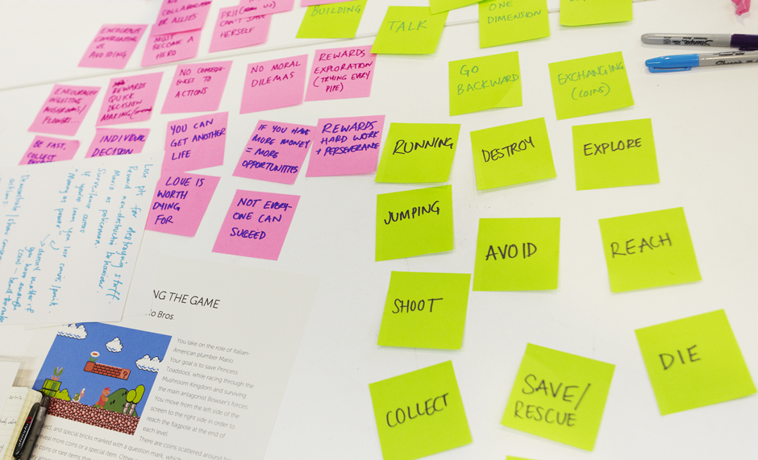
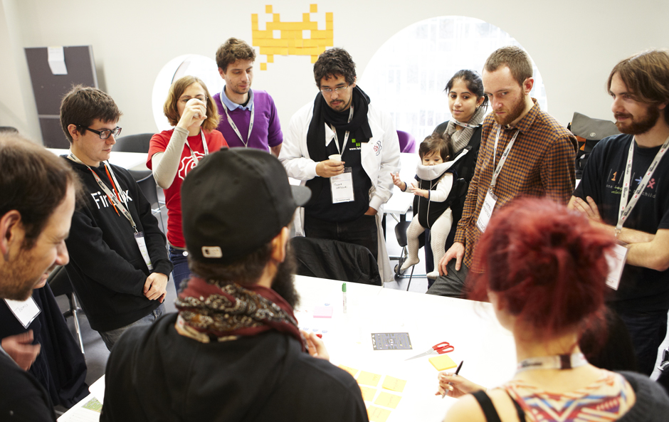
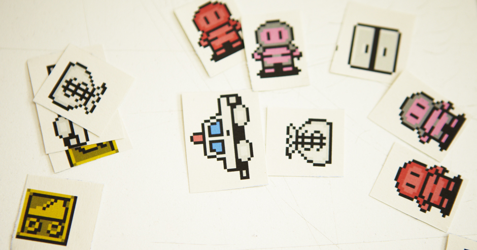
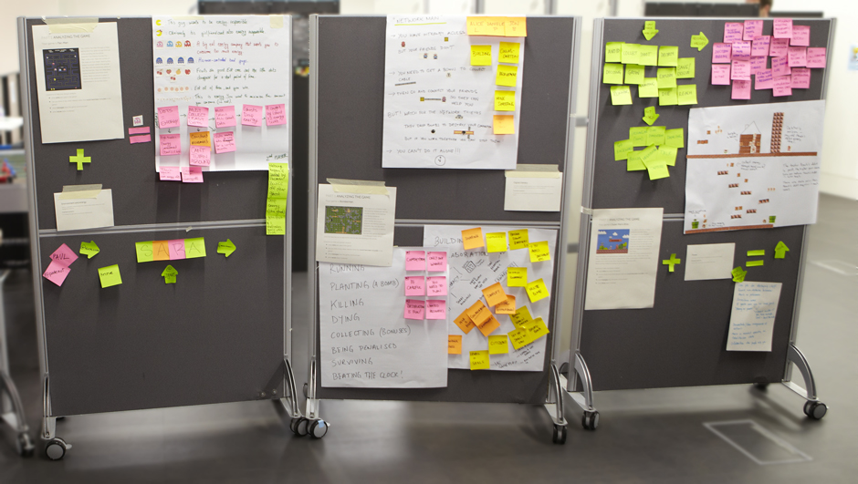
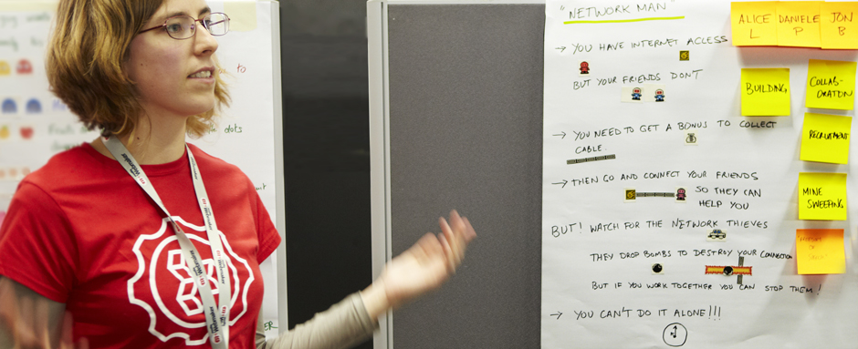

# Hacking games with verbs

Whether it is running or collecting, shooting or trading, **games are driven by verbs**. In this workshop we pick out the verbs that make up a game and explore how these verbs express certain messages and values. Then we **hack the game** with new verbs, so that it communicates our own messages and values.

I *forked* this **workshop recipe** from [this one](http://www.molleindustria.org/blog/a-computerless-videogame-modding-workshop), prepared by [Paolo Pedercini](http://www.molleindustria.org) + [Una Lee](http://unalee.net/) and inspired by [Grow-a-Game](http://www.tiltfactor.org/grow-a-game).

Please take this recipe and try it at home, with your class, club or organisation, and share your results with all people _upstream_ (as per [license](LICENSE)).

## Introduction

Working in small teams, participants receive two creative constraints:

1. A topical **issue**, such as the financial crisis, global climate change, or digital literacy
2. A classic arcade **game**, such as Super Mario Bros, Pac-man, or Space Invaders

The first task is to **discuss the issue** and jot down **messages** participants want to communicate and **behaviours** they want to promote.

Then teams will **analyse the game by looking at its verbs**: what actions players can do, how they can interact with game characters or other players, what they should do to win the game, and what they simply can’t do. Teams will explore how these verbs express messages and morals (which *good behaviours* they promote), ideas and ideologies. 

Finally teams will **redesign the game so that it is about the issue**, using a different set of verbs that reflect the messages and behaviours your team wants to promote. The focus is on changing the _gameplay_[1](#-gameplay), rather than *reskinning* the game.

<!--
1. a classic arcade **game**, such as Super Mario Bros, Pac-man, or Space Invaders
2. a topical **issue**, such as the financial crisis, global climate change, or digital literacy

The first task is to **analyse the game verbs**: what actions players can do, how they can interact with game characters or other players, what they should do to win the game, and what they simply can’t do. Participants explore how these verbs express messages and values, ideas and ideologies. 

Then they **redesign the game so that it is about the issue**, using a different set of verbs that reflect the values and views of the team. Participants are encouraged to consider changing the _gameplay_[1](#-gameplay), as well as the goal(s) and narrative of the game.
-->

Each team is provided with a collection of **pre-cut paper props** ripped from the assigned game, which they use to discuss and prototype alternative gameplays, as opposed to simply re-skin[2](#-re-skin) the game.

<!---->

## Ingredients

To be prepared ahead of the workshop:

1. A **[short presentation](presentation.md)** to be delivered in a _kamishibai_[3](#-kamishibai) fashion, scribbling key concepts on a flip chart as you introduce them to participants, asking them questions and fostering an open discussion. 
2. A set of **printed [game cards](games.md)**, each of them including a visual reference, a short explanation and a few questions to help teams analyse their game.
3. A set of **printed [issue cards](issues.md)**, each of them including related keywords and an example scenario to stimulate different takes on the issue. Participants can choose to approach the issue in an abstract way, in more geographically or historically specific way or anything in between. 
4. A **printed [brainstorming cheatsheet](cheatsheet.md)** with tips and questions to help team discussion.
5. A set of **printed [props](images/games)** for people to use as main movable visual modules when prototyping their new gameplays. Physical paper pieces compel participants to reason in visual and spatial terms. They also allow for a more democratic process, since all team members can rearrange elements as if they were working on a jigsaw puzzle.

Additional materials needed for the paper-prototyping activity:

* large format **paper**, A2 or bigger
* **sharpies** in various tints
* **post-its** in different colours
* **scissors**
* **glue** sticks

## Method

This is how the workshop unfolds:

1. Start with a **[short presentation](presentation.md)**, providing people with a basic theoretical framework and case studies to discuss issues around videogames. 
2. Explain the workshop team activity, **walking through all steps** from the extraction of verbs to the injection of new messages and values into the new game's prototype.
3. Give participants **hints to possible outcomes**, like _PAC-MAN + BULLYING = Pac-Man is a student, bullied by ghosts. Some of them pick on his skin colour, others on his insatiable hunger. In order to defeat the different types of bullies, you need different skills (fruit)_. Examples are crucial, it seems, for people to grasp what they will work towards.
4. **Form teams** of 3 to 5 people.
5. Ask each team to **pick a random videogame and issue cards**. This prevents participants from spending too much time thinking about the game or issue they deem more appropriate. State clearly that the example scenario on the issue card is only an example, but teams can come up with any other scenario where the issue manifests itself.
6. Provide teams with plenty of **paper, post-its and sharpies**. A couple of participants after the workshop suggested a colour-coding system for this phase (eg: green post-its for verbs that are present, yellow post-its for verbs that are not present, pink for values and so on), to make the final outcomes more readable at a glance.
6. Teams **start breaking down the game mechanics into verbs**, and think about the implicit or explicit messages that these verbs entail. The focus is on the game at this stage, yet knowing already the issue may help teams consider how it could be fed into the game later on. Or maybe not, so you could consider introducing the issue cards only after teams have analysed their game.

7. After about half an hour, ask each team to quickly present their analyses so far to everyone else. These short **mid-session presentations** allow teams to compare their thought processes and inform their work.

8. Provide teams with a collection of **game props, printed and pre-cut**. If you don't cut them, people are less likely to use the props, either to negotiate with the other team members, or to visualize their game concept.

9. Ask teams to **explore alternative gameplays**, using verbs from their issue, and messages that represent their views. They will then **paper-prototype** one. This phase should take about an hour.

10. Ask teams to **stick their work on a whiteboard** or otherwise big support that can accommodate everything they produced, positioning elements so that it can be **read as a flow** (ie: game + issue = outcome).

11. Each team **presents** their new game to everyone else. After the workshop people suggested that these final presentations have a 3 minutes constraint, forcing teams to simplify the prototype's gameplay or at least to present a simplified version of their concept.

## Outcomes

Three teams took part in the workshop at the [Mozilla Festival](http://lanyrd.com/2012/mozilla-festival/szkmy/). These are the game concepts they came up with:

1. #### Mario + economy
Princess Toadstool is in debt, and Mario has to bail her out. The more time passes, the bigger her debt grows.
So you set out to gather money and keep up with repayments, while the game keeps throwing moral dilemmas at you: mug people or burgle houses for quick bucks, or go the slower legitimate way of earning money with hard work? This idea sparkled from the thought that actions in the original Mario have no consequences, you keep jumping over turtles and breaking bricks, collecting coins that can't be traded.

2. #### Bomberman + digital literacy
You have Internet connection, but your friends don't. Your first goal is to get them connected, so that you can start building things together. So you set out to find cable and build a physical network, but the network thieves drop bombs to destroy your connections. When you connect another player, they can help you make the network stronger and unlock new challenges to build the Open Web.

3. #### Pac-man + energy
You (Pac-man) want to be energy efficient, but energy corporations want you to waste it. Your goal is to get out of each level's maze by consuming the least amount of energy (dots), while the shiny gadgets and juicy appliances that are thrown at you to increase your bill. This game subverts the Pac-man gameplay by turning its endless hunger and pointless accumulation into a strategic avoidance.

### The party bag

Beyond a few hours of playful activities, during the workshop people can:

* develop a critical thinking approach to entertainment commodities
* practice a methodology that can be applied to game design and user experience design in general, using constraints to channel your creative response
* leave with a prototyped concept, which they could develop further, digitally as a videogame or physically as a board game
* organise similar hack-a-game sessions, independently, in the future 

## Footnotes

######  Gameplay
The system of rules and the ways players interact with characters and objects. [↩](#introduction)

######  Re-skin
Change graphic appearances while keeping the mechanics intact [↩](#introduction)

######  Kamishibai
A form of visual and participatory storytelling that combines the use of hand drawn visuals with the narration of a live presenter. [Learn more about Kamishibai](http://www.presentationzen.com/presentationzen/2011/10/kamishibai-is-a-form-of-visual-and-participatory-storytelling-that-combines-the-use-of-hand-drawn-visuals-with-the-engaging-n.html) [↩](#ingredients)

### License

This work is licensed under a [Creative Commons Attribution-NonCommercial-ShareAlike 4.0 International License ](http://creativecommons.org/licenses/by-nc-sa/4.0)
